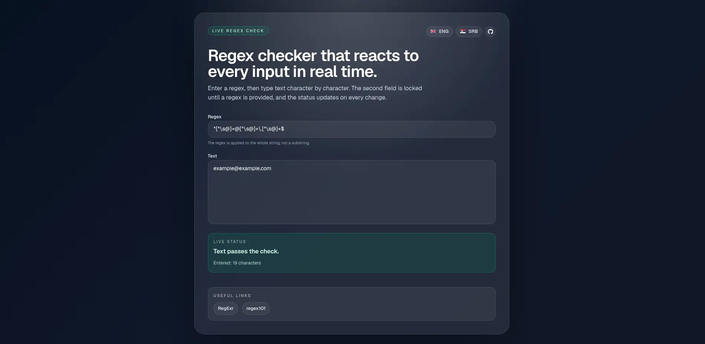

# Regex Check

This repository contains a small Next.js app that performs live regex checks on text input.

## [Live Demo](https://regexcheck.vercel.app/)



## What it does

- Accepts a regular expression in the first input
- Unlocks the second text input only after a regex is provided
- Re-evaluates the text on every change and shows a live pass/fail status
- Shows `empty string` when the input is empty
- Responsive UI for mobile, tablet and desktop
- Language toggle (ENG / SRB) in the header

## Run locally

Install dependencies and start the dev server:

```bash
npm install
npm run dev
```

Open http://localhost:3000 in your browser.

## Production build

```bash
npm run build
npm start
```

## Tech stack

- Next.js 16
- React 19
- TypeScript
- Tailwind CSS v4


## Notes

- The app uses full-string matching by default (the regex is wrapped with anchors in the client code).

---
